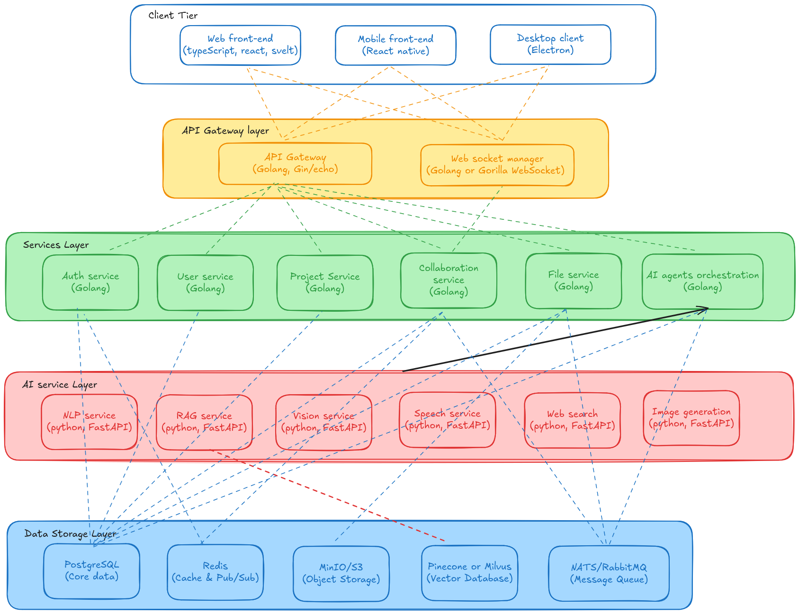
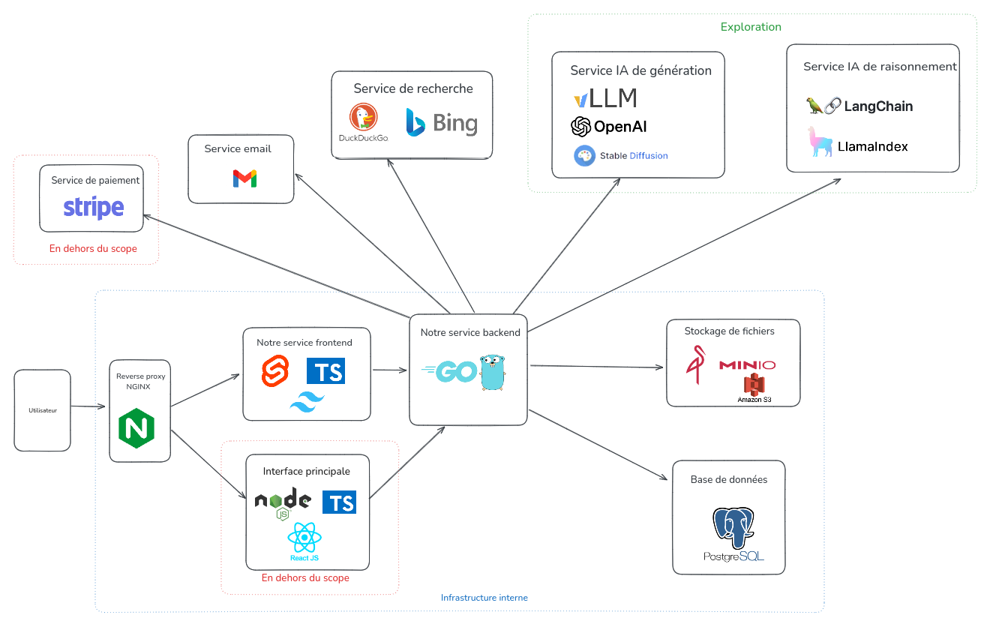

# Hello Pulse Microservices Architecture

## Overview

Hello Pulse is a collaborative brainstorming platform powered by artificial intelligence, designed according to a modern and scalable microservices architecture. This architecture allows for independent evolution of components, high availability, and integration of cutting-edge AI technologies.

## Layer Structure

The architecture adopts a 5-layer approach, each with specific responsibilities and technologies tailored to its needs.



### 1. Client Tier

This layer includes all user interfaces accessible to end users.

| Component | Technology | Description |
|-----------|-------------|-------------|
| Web Front-end | TypeScript, React, Svelte | Responsive web application for desktop and mobile browsers |
| Mobile Front-end | React Native | Native mobile application for iOS and Android |
| Desktop Client | Electron | Cross-platform desktop application |

**Advantages**:
- Consistent user experience across all platforms
- Code sharing between different interfaces
- Offline mode support for desktop client

### 2. API Gateway Layer

Acts as a unified entry point for all client-server communications.

| Component | Technology | Description |
|-----------|-------------|-------------|
| API Gateway | Golang (Gin/Echo) | Request routing, authentication, authorization, and load balancing |
| Web Socket Manager | Golang (Gorilla WebSocket) | Management of real-time connections for collaboration |

**Responsibilities**:
- Centralized authentication management
- Intelligent request routing to appropriate services
- Rate limiting and monitoring
- API documentation management (Swagger/OpenAPI)

### 3. Services Layer

Implements the main business logic via specialized microservices.

| Service | Technology | Responsibilities |
|---------|-------------|-----------------|
| Auth Service | Golang | Authentication, session management, OAuth |
| User Service | Golang | Profile management, organizations, permissions |
| Project Service | Golang | Project creation and management, templates |
| Collaboration Service | Golang | Real-time synchronization, presence management |
| File Service | Golang | File processing and storage |
| AI Agents Orchestration | Golang | Coordination of AI services, workflow management |

**Characteristics**:
- Autonomous services with dedicated databases when necessary
- Inter-service communication via REST API and gRPC
- High performance thanks to Golang utilization

### 4. AI Services Layer

Offers advanced artificial intelligence capabilities through specialized services.

| Service | Technology | Features |
|---------|-------------|-----------------|
| NLP Service | Python, FastAPI | Text generation, semantic analysis |
| RAG Service | Python, FastAPI | Document indexing, semantic search |
| Vision Service | Python, FastAPI | Image analysis, object detection |
| Speech Service | Python, FastAPI | Text-to-speech and speech-to-text conversion |
| Web Search | Python, FastAPI | External web search integration |
| Image Generation | Python, FastAPI | AI-powered image generation |

**Strengths**:
- Python implementation to leverage the ML/AI ecosystem
- High-performance APIs with FastAPI
- Pre-trained and extensible models

### 5. Data Storage Layer

Ensures data persistence with specialized technologies for each data type.

| Component | Technology | Usage |
|-----------|-------------|-------------|
| PostgreSQL | SQL | Main structured data (users, projects) |
| Redis | In-memory | Cache and PubSub for temporary and real-time data |
| MinIO/S3 | Object Storage | File and media storage |
| Pinecone/Milvus | Vector Database | Vector search for AI embeddings |
| NATS/RabbitMQ | Message Queue | Asynchronous communication between services |

**Advantages**:
- Specialized solutions by data type
- High performance and scalability
- Flexibility for future evolution

## Communication Patterns

### Synchronous Communication

1. **REST (HTTP/JSON)**
   - Used for: Client-server API, simple CRUD operations
   - Advantages: Standard, easy to debug, compatible with all clients

2. **gRPC (Protocol Buffers)**
   - Used for: High-performance inter-service communication
   - Advantages: Strongly typed API contracts, superior performance, bidirectional streaming

### Asynchronous Communication

1. **Message Queue (NATS/RabbitMQ)**
   - Used for: Event processing, long-duration operations
   - Patterns: Publish/Subscribe, Request/Reply, Work Queues
   - Advantages: Service decoupling, better resilience

2. **WebSockets**
   - Used for: Real-time collaboration, notifications
   - Advantages: Bidirectional communication, low latency

### Data Consistency Patterns

1. **Outbox Pattern**
   - Guarantees reliable message delivery with transactions
   - Eventually consistent synchronization between services

2. **CQRS (Command Query Responsibility Segregation)**
   - Separates read and write models
   - Optimizes performance for different types of operations

# Proposed File Organization for Hello Pulse Platform



Based on my analysis, I'm proposing a restructured file organization that maintains the strengths of your current architecture while addressing the improvement opportunities we identified. This structure emphasizes domain-driven design, supports ML model lifecycle management, and provides clear separation of concerns.

## Root Directory Structure

```
hello-pulse/
├── backend/           # Golang-based backend services
├── ai-services/       # Python-based AI services
├── clients/           # Frontend applications
├── infrastructure/    # Infrastructure as code
├── docs/              # Documentation
├── scripts/           # Utility scripts
├── .github/           # CI/CD workflows
├── Makefile           # Project-wide command definitions
├── docker-compose.yml # Development environment setup
├── .env.example       # Environment variable template
└── README.md          # Project overview
```

## Backend Structure

```
Hello-Pulse/
├── backend/
│   ├── cmd/                       # Service entry points
│   │   ├── api-gateway/
│   │   ├── auth-service/
│   │   ├── user-service/
│   │   ├── project-service/
│   │   ├── file-service/
│   │   ├── collaboration-service/
│   │   └── ai-orchestrator/
│   ├── internal/
│   │   ├── models/                # All data models grouped by domain
│   │   │   ├── user/              # User-related models
│   │   │   ├── organization/      # Organization-related models
│   │   │   ├── project/           # Project-related models
│   │   │   ├── file/              # File-related models 
│   │   │   ├── auth/              # Authentication-related models
│   │   │   └── ai/                # AI-related models
│   │   ├── repositories/          # Database access code
│   │   │   ├── user/
│   │   │   ├── organization/
│   │   │   ├── project/
│   │   │   ├── file/
│   │   │   ├── auth/
│   │   │   └── ai/
│   │   ├── services/              # Business logic
│   │   │   ├── user/
│   │   │   ├── auth/
│   │   │   ├── project/
│   │   │   ├── file/
│   │   │   ├── collaboration/
│   │   │   └── ai/
│   │   ├── api/                   # API layer
│   │   │   ├── handlers/
│   │   │   ├── middleware/
│   │   │   ├── routes/
│   │   │   └── validation/
│   │   ├── gateway/               # API Gateway specific code
│   │   │   ├── proxy/
│   │   │   └── middleware/
│   │   └── config/                # Configuration
│   ├── pkg/                       # Shared utilities
│   │   ├── database/              # Database connection
│   │   ├── storage/               # File storage utilities
│   │   ├── jwt/                   # JWT utilities
│   │   └── logger/                # Logging utilities
│   └── test/                      # Testing framework
├── ai-services/                   # Python AI services
├── clients/                       # Frontend clients
├── infrastructure/                # Infrastructure configuration
├── docs/                          # Documentation
└── scripts/                       # Utility scripts
```

## AI Services Structure

```
ai-services/
├── core/                      # Shared AI components
│   ├── models/                # Base model interfaces
│   ├── embeddings/            # Vector embedding utilities
│   ├── evaluation/            # Model evaluation metrics
│   ├── config/                # Configuration management
│   ├── data/                  # Data processing utilities
│   └── logging/               # AI-specific logging
├── llm_service/               # Natural Language Processing
│   ├── models/                # Model implementations
│   ├── routers/               # FastAPI routes
│   ├── utils/                 # Service-specific utilities
│   └── schemas/               # Data schemas
├── rag_service/               # Retrieval-Augmented Generation
│   ├── indexing/
│   ├── retrieval/
│   ├── routers/
│   └── schemas/
├── vision_service/            # Computer Vision
│   ├── detection/
│   ├── segmentation/
│   ├── recognition/
│   ├── routers/
│   └── schemas/
├── speech_service/            # Speech processing
│   ├── tts/                   # Text-to-speech
│   ├── stt/                   # Speech-to-text
│   ├── routers/
│   └── schemas/
├── web_search/                # Web search integration
│   ├── engines/
│   ├── routers/
│   └── schemas/
├── image_generation/          # Image generation service
│   ├── models/
│   ├── routers/
│   └── schemas/
├── tests/                     # AI-specific testing
│   ├── unit/
│   ├── integration/
│   └── model_evaluation/      # ML model performance tests
├── main.py                    # Entry point
├── requirements.txt           # Dependencies
└── Dockerfile                 # Container definition
```

## Client Structure

```
clients/
├── web/                       # Web frontend
│   ├── src/
│   │   ├── assets/            # Static assets
│   │   ├── components/        # Reusable UI components
│   │   │   ├── ui/            # Base UI elements
│   │   │   ├── layout/        # Layout components
│   │   │   ├── projects/      # Project components
│   │   │   ├── auth/          # Authentication components
│   │   │   └── ai/            # AI-related components
│   │   ├── pages/             # Application views
│   │   ├── hooks/             # Custom React hooks
│   │   ├── context/           # State management
│   │   ├── services/          # API client code
│   │   ├── utils/             # Utility functions
│   │   └── types/             # TypeScript type definitions
│   ├── public/                # Public assets
│   ├── tests/                 # Frontend tests
│   │   ├── unit/
│   │   ├── integration/
│   │   └── e2e/
│   ├── package.json           # Dependencies
│   ├── tsconfig.json          # TypeScript configuration
│   └── Dockerfile             # Container definition
├── mobile/                    # React Native mobile app
│   ├── src/
│   │   ├── components/
│   │   ├── screens/
│   │   ├── navigation/
│   │   ├── services/
│   │   └── hooks/
│   ├── tests/
│   └── package.json
└── desktop/                   # Electron desktop app
    ├── src/
    │   ├── main/              # Main process
    │   ├── renderer/          # Renderer process
    │   └── shared/            # Shared code
    ├── tests/
    └── package.json
```

## Infrastructure Structure

```
infrastructure/
├── docker/                    # Docker configurations
│   ├── development/
│   └── production/
├── kubernetes/                # Kubernetes manifests
│   ├── base/
│   ├── development/
│   └── production/
├── terraform/                 # Infrastructure as code
│   ├── modules/
│   ├── development/
│   └── production/
├── monitoring/                # Monitoring setup
│   ├── prometheus/
│   ├── grafana/
│   └── elk/
├── redis/                     # Redis configuration
├── vector-db/                 # Vector database setup
└── databases/                 # Database migrations
    ├── postgres/
    └── scripts/
```

## Key Improvements

### 1. Domain-Oriented Backend Structure

The backend now follows a domain-driven design approach with clear separation between:

- **Domain:** Core business models and interfaces
- **Services:** Business logic implementations
- **API:** External-facing handlers and routes
- **Infrastructure:** Technical components

This organization makes it easier to navigate the codebase based on business domains rather than technical concerns.

### 2. Enhanced AI Services Structure

The AI services structure now includes:

- **Core shared components:** Base models, embeddings, evaluation metrics
- **Service-specific implementations:** Organized by capability (NLP, Vision, etc.)
- **Model lifecycle management:** Clear separation of model implementation from API routes

This structure will better support your ML/DL workflow preferences, including data exploration, model building, and evaluation.

### 3. Comprehensive Testing Framework

Testing directories are now integrated throughout the codebase:

- **Backend testing:** Unit, integration, benchmark, and end-to-end tests
- **AI-specific testing:** ML model evaluation and performance testing
- **Frontend testing:** Component, integration, and E2E testing

This supports your preference for rigorous validation and cross-validation techniques.

### 4. Frontend Learning Structure

The frontend structure is organized to support your TypeScript and React learning goals:

- **Component-based architecture:** Clear separation of UI components
- **TypeScript integration:** Dedicated types directory
- **React patterns:** Hooks, context, and services directories

This structure follows React best practices while making it easy to find and learn from specific implementations.

### 5. Infrastructure and Monitoring

Enhanced infrastructure organization includes:

- **Multi-environment configurations:** Development, staging, production
- **Monitoring tools:** Prometheus, Grafana, ELK stack
- **Infrastructure as code:** Terraform modules for cloud deployments

This setup will facilitate DevOps best practices and environment consistency.
