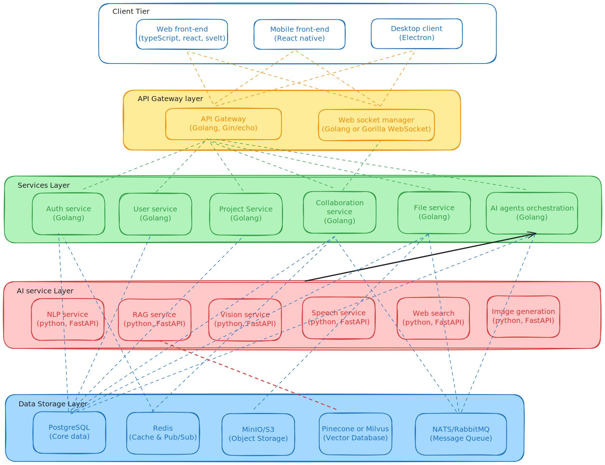

# Hello Pulse Microservices Architecture

## Overview

Hello Pulse is a collaborative brainstorming platform powered by artificial intelligence, designed according to a modern and scalable microservices architecture. This architecture allows for independent evolution of components, high availability, and integration of cutting-edge AI technologies.

## Layer Structure

The architecture adopts a 5-layer approach, each with specific responsibilities and technologies tailored to its needs.

### 1. Client Tier

This layer includes all user interfaces accessible to end users.

| Component | Technology | Description |
|-----------|-------------|-------------|
| Web Front-end | TypeScript, React, Svelte | Responsive web application for desktop and mobile browsers |
| Mobile Front-end | React Native | Native mobile application for iOS and Android |
| Desktop Client | Electron | Cross-platform desktop application |

**Advantages**:
- Consistent user experience across all platforms
- Code sharing between different interfaces
- Offline mode support for desktop client

### 2. API Gateway Layer

Acts as a unified entry point for all client-server communications.

| Component | Technology | Description |
|-----------|-------------|-------------|
| API Gateway | Golang (Gin/Echo) | Request routing, authentication, authorization, and load balancing |
| Web Socket Manager | Golang (Gorilla WebSocket) | Management of real-time connections for collaboration |

**Responsibilities**:
- Centralized authentication management
- Intelligent request routing to appropriate services
- Rate limiting and monitoring
- API documentation management (Swagger/OpenAPI)

### 3. Services Layer

Implements the main business logic via specialized microservices.

| Service | Technology | Responsibilities |
|---------|-------------|-----------------|
| Auth Service | Golang | Authentication, session management, OAuth |
| User Service | Golang | Profile management, organizations, permissions |
| Project Service | Golang | Project creation and management, templates |
| Collaboration Service | Golang | Real-time synchronization, presence management |
| File Service | Golang | File processing and storage |
| AI Agents Orchestration | Golang | Coordination of AI services, workflow management |

**Characteristics**:
- Autonomous services with dedicated databases when necessary
- Inter-service communication via REST API and gRPC
- High performance thanks to Golang utilization

### 4. AI Services Layer

Offers advanced artificial intelligence capabilities through specialized services.

| Service | Technology | Features |
|---------|-------------|-----------------|
| NLP Service | Python, FastAPI | Text generation, semantic analysis |
| RAG Service | Python, FastAPI | Document indexing, semantic search |
| Vision Service | Python, FastAPI | Image analysis, object detection |
| Speech Service | Python, FastAPI | Text-to-speech and speech-to-text conversion |
| Web Search | Python, FastAPI | External web search integration |
| Image Generation | Python, FastAPI | AI-powered image generation |

**Strengths**:
- Python implementation to leverage the ML/AI ecosystem
- High-performance APIs with FastAPI
- Pre-trained and extensible models

### 5. Data Storage Layer

Ensures data persistence with specialized technologies for each data type.

| Component | Technology | Usage |
|-----------|-------------|-------------|
| PostgreSQL | SQL | Main structured data (users, projects) |
| Redis | In-memory | Cache and PubSub for temporary and real-time data |
| MinIO/S3 | Object Storage | File and media storage |
| Pinecone/Milvus | Vector Database | Vector search for AI embeddings |
| NATS/RabbitMQ | Message Queue | Asynchronous communication between services |

**Advantages**:
- Specialized solutions by data type
- High performance and scalability
- Flexibility for future evolution

## Communication Patterns

### Synchronous Communication

1. **REST (HTTP/JSON)**
   - Used for: Client-server API, simple CRUD operations
   - Advantages: Standard, easy to debug, compatible with all clients

2. **gRPC (Protocol Buffers)**
   - Used for: High-performance inter-service communication
   - Advantages: Strongly typed API contracts, superior performance, bidirectional streaming

### Asynchronous Communication

1. **Message Queue (NATS/RabbitMQ)**
   - Used for: Event processing, long-duration operations
   - Patterns: Publish/Subscribe, Request/Reply, Work Queues
   - Advantages: Service decoupling, better resilience

2. **WebSockets**
   - Used for: Real-time collaboration, notifications
   - Advantages: Bidirectional communication, low latency

### Data Consistency Patterns

1. **Outbox Pattern**
   - Guarantees reliable message delivery with transactions
   - Eventually consistent synchronization between services

2. **CQRS (Command Query Responsibility Segregation)**
   - Separates read and write models
   - Optimizes performance for different types of operations

