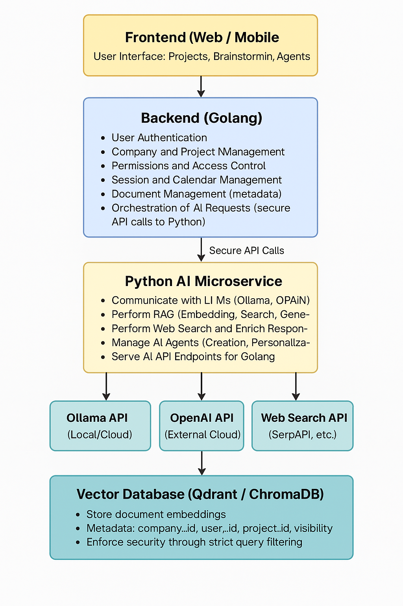

# 🧠 Full Summary of Our Architecture and Design



## 1. Global System Design

we are building a **next-generation collaborative brainstorming platform** with **AI integration**.

- **Golang**: Main backend → User management, projects/sub-projects management, permissions, dashboards, overall orchestration.
- **Python**: AI microservice → All intelligence tasks like LLM communication (Ollama, OpenAI), RAG (Retrieval-Augmented Generation), Web Search, Agent management.

They are separated for **scalability**, **performance**, and **technology specialization**.

---

## 2. What will be developed in **Python** (AI Microservice)

| Component | Details |
|-----------|---------|
| **LLM Interactions** | Communication with Ollama and OpenAI APIs to generate text and ideas. |
| **RAG (Retrieval-Augmented Generation)** | - Embedding documents.<br> - Storing vectors in a vector database.<br> - Performing semantic search inside user/company documents. |
| **Web Search** | Perform real-time internet searches to augment answers with up-to-date information. |
| **Agent IA Creation** | Create and manage AI agents linked to user/company documents and specific instructions. |
| **Vector Database Management** | Insert, search, and filter embeddings based on user/company/project permissions. |
| **Advanced Orchestration** | Combine LLM + RAG + Web Search into smart pipelines.<br> Handle long conversations and context preservation. |
| **TTS/STT (optional later)** | Voice interaction with AI agents (Text-to-Speech / Speech-to-Text). |
| **API Endpoints** | Expose clean APIs for Golang to interact with: `/generate`, `/rag_generate`, `/search_and_generate`, `/create_agent`, `/chat_with_agent`, etc. |

---

## 3. What will be developed in **Golang** (Main Backend)

| Component | Details |
|-----------|---------|
| **User Management** | Accounts, authentication (JWT), roles (Admin, Member, Guest). |
| **Company Management** | Multi-tenant system (companies fully separated logically). |
| **Projects and Sub-Projects** | Infinite hierarchical structure of projects and brainstorming sessions. |
| **Document Management** | Uploading and managing user documents (linking documents to projects and users). |
| **Permissions and Access Control** | Ensuring users can only access documents they own or that are public/shared within their company. |
| **Session and Calendar Management** | Scheduling brainstorming sessions, reminders, and synchronization with Google/Outlook calendars. |
| **Dashboards and Statistics** | Track number of brainstorms, ideas generated, agent usage, etc. |
| **Orchestration of AI Requests** | Forwarding structured AI requests to the Python microservice securely, enforcing access rights. |
| **Metadata Management for Vector DB** | Managing non-sensitive metadata related to vectors (e.g., company_id, user_id, project_id) but **NOT** vectors themselves. |
| **Secure Communication with Python Microservice** | Ensuring secure API calls (with internal authentication tokens or JWTs). |

---

## 4. Vector Database Considerations

| Topic | Decision |
|------|----------|
| **Where to store vectors** | In a **dedicated vector database** like **Qdrant** or **ChromaDB**. |
| **What metadata to store with vectors** | - `company_id`<br> - `user_id`<br> - `project_id`<br> - `visibility` (private, shared_in_company, public) |
| **How to ensure security** | All vector searches must apply strict filters (e.g., company_id = current user’s company). |
| **At MVP (early stage)** | Use **a single shared vector database**.<br> Apply strict filtering in search queries.<br> Keep management simple and costs low. |
| **When scaling** | Move to **one vector database per company** (or separate collections per company) when:<br> - Company size becomes very large (e.g., >100,000 vectors),<br> - Premium clients request dedicated storage,<br> - Companies request on-premises hosting for security reasons. |
| **How to prepare for future migration** | Always store and filter based on metadata now.<br> Design flexible search APIs that can switch databases or collections dynamically later. |

---

## 5. Key Principles to Follow

- **Golang** orchestrates all business logic, manages security, users, and projects.
- **Python** focuses only on **intelligence tasks** (LLM interaction, RAG, Search, Agents).
- **Always filter vector searches** based on company/user permissions.
- **Start simple** with a shared vector DB, **scale smart** by separating companies later if necessary.
- **Secure internal communications** between Golang and Python (e.g., using JWTs or internal API keys).

---

# 🚀 Quick Architecture Overview (Final)

```plaintext
Frontend (Web / Mobile)
   ⬇
Backend (Golang)
   ⬇
Python AI Microservice
   ⬇
- Ollama API (Cloud or Local)
- OpenAI API
- Web Search APIs
- Vector DB (Qdrant/ChromaDB)
```

---

# 🎯 In short:
> **Start with one simple vector DB, secure properly, scale later by isolating companies when needed.**  
> **Golang orchestrates everything; Python executes all AI tasks.**

---

Would you also like me to prepare a **small clean diagram** showing this architecture visually?  
It would be perfect for your documentation or to present it to your team later! 🚀  
Let me know! 🎯